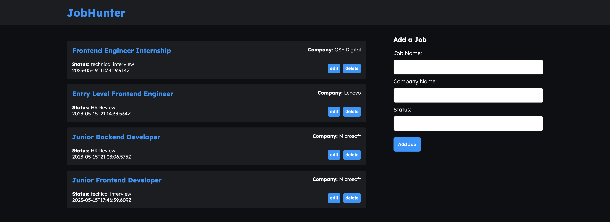

# JobHunter App

JobHunter is a simple MERN (MongoDB, Express.js, React.js, Node.js) application designed to help job seekers manage their job applications. It allows users to add and delete job entries, and in the future, it will include functionality for editing existing job entries.

## Features

- Add a new job entry, including job title, company, and application status.
- Delete a job entry.
- (Future Enhancement) Edit existing job entries.

## Future Enhancements

In the future, the JobHunter app will include the following enhancements:

- Edit functionality: Users will be able to update the details of existing job entries.
- User authentication: Implement user authentication to provide personalized job management for individual users.
- Search and filter: Add the ability to search and filter job entries.
- UI/UX improvements: Enhance the user interface and experience to make it more intuitive and visually appealing.

